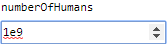

 [GenericInput](../../model/genericInput/genericInput.md)

----

# IntegerVariable

The  IntegerVariable atom is used to specify an integer input value for a model, e.g. for a  [GenericInput](../../model/genericInput/genericInput.md) model):



You can enter a value directly or use the arrow buttons on the right side of the input field to increase/decrease the number by 1. 

Treez is based on JavaScript and [numbers in JavaScript have some limitations](http://www.javascripter.net/faq/accuracy.htm). 

## Source code

[./src/variable/field/integerVariable.js](../../../../src/variable/field/integerVariable.js)

## Construction

A new  IntegerVariable atom is created either 

* from the context menu of a  [GenericInput](../../model/genericInput/genericInput.md) atom in the [Tree View](../../../views/treeView.md) or 

* by calling the corresponding factory method of a parent atom in the source code of the [Editor View](../../../views/editorView.md):	

```javascript
    ...
    genericInput.createIntegerVariable('numberOfHumans', 8e9);
```

----
 [QuantityVariable](./quantityVariable.md)
