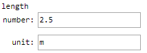

 [GenericInput](../../model/genericInput/genericInput.md)

----

# QuanityVariable

The  QuanityVariable atom is used to specify a physical quantity, consisting of a (fouble) value and a unit. Quantities can be used with some models, e.g. the  [GenericInput](../../model/genericInput/genericInput.md) model):



Treez is based on JavaScript and [numbers in JavaScript have some limitations](http://www.javascripter.net/faq/accuracy.htm). 

## Source code

[./src/variable/field/quanityVariable.js](../../../../src/variable/field/quantityVariable.js)

## Construction

A new  QuanityVariable atom is created either 

* from the context menu of a  [GenericInput](../../model/genericInput/genericInput.md) atom in the [Tree View](../../../views/treeView.md) or 

* by calling the corresponding factory method of a parent atom in the source code of the [Editor View](../../../views/editorView.md):	

```javascript
    ...
    genericInput.createQuanityVariable('length', Quantity(5, 'm'));
```

----
 [BooleanVariable](./booleanVariable.md)
