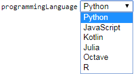

 [GenericInput](../../model/genericInput/genericInput.md)

----

# StringItemVariable

The  StringItemVariable atom provides a combo box to select a text item from a list of predefined text items: 



## Source code

[./src/variable/field/stringItemVariable.js](../../../../src/variable/field/stringItemVariable.js)

## Construction

A new  StringItemVariable atom is created either 

* from the context menu of a  [GenericInput](../../model/genericInput/genericInput.md) atom in the [Tree View](../../../views/treeView.md) or 

* by calling the corresponding factory method of a parent atom in the source code of the [Editor View](../../../views/editorView.md):	

```javascript
    ...
    genericInput.createStringItemVariable('tag', 'python');
```

The available text items can be specified by clicking on the  StringItemVariable atom in the [Tree View](../../../views/treeView.md) and editing the commo separated list of available text items in the [Properties View](../../../views/propertiesView.md) 

----
 [FilePathVariable](./filePathVariable.md)
