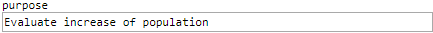

 [GenericInput](../../model/genericInput/genericInput.md)

----

# StringVariable

The  StringVariable atom is used to specify a text value: 



## Source code

[./src/variable/field/stringVariable.js](../../../../src/variable/field/stringVariable.js)

## Construction

A new  StringVariable atom is created either 

* from the context menu of a  [GenericInput](../../model/genericInput/genericInput.md) atom in the [Tree View](../../../views/treeView.md) or 

* by calling the corresponding factory method of a parent atom in the source code of the [Editor View](../../../views/editorView.md):	

```javascript
    ...
    genericInput.createStringVariable('purpose', 'Evaluate increase of population');
```

----
 [StringItemVariable](./stringItemVariable.md)
