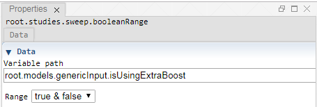

 [Sweep](../../study/sweep/sweep.md)

----

# BooleanRange
	
The purpose of the  BooleanRange atom is to select a range of boolean values.
		


The range can be disabled/enabled through the context menu of the atom. The disabled state is shown by a  decorator icon in the [Tree View](../../../views/treeView.md).
		
## Source code

[./src/variable/range/booleanRange.js](../../../../src/variable/range/booleanRange.js)

## Construction
		
A new  BooleanRange atom atom is created either by: 

* using the context menu of a  [Sweep](../../study/sweep/sweep.md) atom in the [Tree View](../../../views/treeView.md) or
* calling the corresponding factory method of the  [Sweep](../../study/sweep/sweep.md) atom in the source code of the [Editor view](../../../views/editorView.md):

```javascript
    ...
    let isUsingExtraBoostRange = models.createBooleanRange('root.models.genericInput.isUsingExtraBoost', [true, false]);	     
```						
		
## Properties

### Data

#### Variable path

The tree path to the variable that should be controlled by the range.

#### Range

Please select the boolean range you would like to use:
* true & false or 
* false & true

----

 [StringRange](./stringRange.md) 

