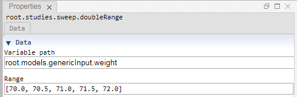

 [Sweep](../../study/sweep/sweep.md)

----

# DoubleRange
	
The purpose of the  atom is to edit a range of double values. 
		


The range can be disabled/enabled through the context menu of the atom. The disabled state is shown by a  decorator icon in the [Tree View](../../../views/treeView.md).
		
## Source code

[./src/variable/range/doubleRange.js](../../../../src/variable/range/doubleRange.js)

## Construction
		
A new  atom atom is created either by: 

* using the context menu of a  [Sweep](../../study/sweep/sweep.md) atom in the [Tree View](../../../views/treeView.md) or
* calling the corresponding factory method of the  [Sweep](../../study/sweep/sweep.md) atom in the source code of the [Editor view](../../../views/editorView.md):

```javascript
    ...
    var weightRange = models.createDoubleRange('root.models.genericInput.weight',[70.0, 70.5, 71.0, 71.5, 72.0]);	     
```						
		
## Sections

### Data

#### Variable path

The tree path to the variable that should be controlled by the range.

#### Range

A comma separated list of range values in square brackets, e.g. [0.5, 1, 1.5, 2] or a range command range(min, max, step), e.g. range(0.5, 2, 0.5)

----

 [IntegerRange](./integerRange.md) 

