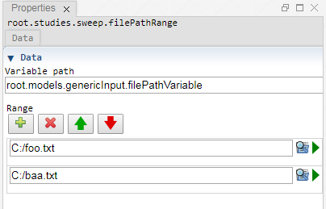

 [Sweep](../../study/sweep/sweep.md)

----

# FilePathRange
	
The purpose of the  FilePathRange atom is to edit a range of file paths. 
		


The range can be disabled/enabled through the context menu of the atom. The disabled state is shown by a  decorator icon in the [Tree View](../../../views/treeView.md).
		
## Source code

[./src/variable/range/filePathRange.js](../../../../src/variable/range/filePathRange.js)

## Construction
		
A new  FilePathRange atom atom is created either by: 

* using the context menu of a  [Sweep](../../study/sweep/sweep.md) atom in the [Tree View](../../../views/treeView.md) or
* calling the corresponding factory method of the  [Sweep](../../study/sweep/sweep.md) atom in the source code of the [Editor view](../../../views/editorView.md):

```javascript
    ...
    let filePathRange = models.createFilePathRange('root.models.genericInput.filePathVariable', ['C:\foo.txt', 'C:\baa.txt']);	     
```						
		
## Sections

### Data

#### Variable path

The tree path to the variable that should be controlled by the range.

#### Range

A list of file paths. Use the buttons and text fields to edit the entries of the list:
*  Add entry
*  Delete entry
*  Move entry up
*  Move entry down 

----

 [DirectoryPathRange](./directoryPathRange.md) 

