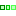
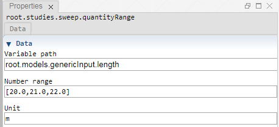

 [Sweep](../../study/sweep/sweep.md)

----

# QuantityRange
	
The purpose of the  IntegerRange atom is to edit a range of integer values. 
		


The range can be disabled/enabled through the context menu of the atom. The disabled state is shown by a  decorator icon in the [Tree View](../../../views/treeView.md).
		
## Source code

[./src/variable/range/quantityRange.js](../../../../src/variable/range/quantityRange.js)

## Construction
		
A new  QuantityRange atom atom is created either by: 

* using the context menu of a  [Sweep](../../study/sweep/sweep.md) atom in the [Tree View](../../../views/treeView.md) or
* calling the corresponding factory method of the  [Sweep](../../study/sweep/sweep.md) atom in the source code of the [Editor view](../../../views/editorView.md):

```javascript
    ...
    var lengthRange = models.createQuantityRange('root.models.genericInput.length', [20.0, 21.0, 22.0], 'm');	     
```						
		
## Sections

### Data

#### Variable path

The tree path to the variable that should be controlled by the range.

#### Range

A comma separated list of range values in square brackets, e.g. [13,14,15] or a range command range(min, max, step), e.g. range(13,15,1)

----

 [BooleanRange](./booleanRange.md) 

