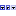

 [Sweep](../../study/sweep/sweep.md)

----

# StringItemRange
	
The purpose of the  StringItemRange atom is to edit a range of predefined string items. 
		


The range can be disabled/enabled through the context menu of the atom. The disabled state is shown by a  decorator icon in the [Tree View](../../../views/treeView.md).
		
## Source code

[./src/variable/range/stringItemRange.js](../../../../src/variable/range/stringItemRange.js)

## Construction
		
A new  StringItemRange atom atom is created either by: 

* using the context menu of a  [Sweep](../../study/sweep/sweep.md) atom in the [Tree View](../../../views/treeView.md) or
* calling the corresponding factory method of the  [Sweep](../../study/sweep/sweep.md) atom in the source code of the [Editor view](../../../views/editorView.md):

```javascript
    ...
    var ageRange = models.createStringItemRange('root.models.genericInput.type', ['foo', 'baa']);	     
```						
		
## Sections

### Data

#### Variable path

The tree path to the variable that should be controlled by the range.

#### Range

A list of string item values. Use the buttons and combo boxes to edit the entries of the list:
*  Add entry
*  Delete entry
*  Move entry up
*  Move entry down 

----

 [FilePathRange](./filePathRange.md) 

