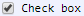

[Components](../components.md)

----

# CheckBox
		
The CheckBox represents a boolean value (**true** or **false**). 
	

		
## Source code

[./src/components/checkBox/treezCheckBox.js](../../../src/components/checkBox/treezCheckBox.js)

## Test

[./test/components/checkBox/treezCheckBox.test.js](../../../test/components/checkBox/treezCheckBox.test.js)

## Demo

[./demo/components/checkBox/treezCheckBoxDemo.html](../../../demo/components/checkBox/treezCheckBoxDemo.html)

## Construction

```javascript
    ...
    sectionContent.append('treez-check-box')
		  .label('Hallo')		  
		  .value('')		
		  .bindValue(this, () => this.isShowingHalloMessage);	
   ...
```

## JavaScript Attributes

### value

The current value as a boolean value. 

### Inherited attributes

Also see the attributes that are inherited from [LabeledTreezElement](../labeledTreezElement.md#value).


## HTML String Attributes

### value

Represents the current value as string. If you want to specify **false**:

* Do not specify the 'value' attribute in the html tag 'treez-check-box'.

* Use element.setAttribute('value',null)

If you want to specify **true**:

* Set the 'value' attribute in the html tag 'treez-check-box' to any value (e.g. value = '' or value = null or value = 'true' or value = 'False'). Only the existance matters.

* Use element.setAttribute('value','') (or set it to any other value that is not equal to null). 

### Inherited attributes

Also see the attributes that are inherited from [LabeledTreezElement](../labeledTreezElement.md#value-1).

----

[CodeArea](../text/code/codeArea.md)
