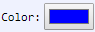

[Components](../components.md)

----

# Color
		
The Color component allows to select a color. Click on the color to open a color selection dialog.
	


The enum [./src/components/color/color.js](../../../src/components/color/color.js) provides some predefined color values, 
that are used with the JavaScript attribute 'value' (also see below). 


Color.black =>  '#000000'

Color.blue =>  '#0000ff'

Color.cyan =>  '#00ffff'

Color.darkblue =>  '#00008b'

Color.darkcyan =>  '#008b8b' 

Color.darkgreen =>  '#006400'

Color.darkmagenta =>  '#8b008b'

Color.darkred =>  '#8b0000'

Color.green =>  '#008000'

Color.grey =>  '#808080'

Color.magenta =>  '#ff00ff'

Color.red =>  '#ff0000'

Color.white =>  '#ffffff'

Color.yellow =>  '#ffff00'

		
## Source code

[./src/components/color/treezColor.js](../../../src/components/color/treezColor.js)

## Test

[./test/components/color/treezColor.test.js](../../../test/components/color/treezColor.test.js)

## Demo

[./demo/components/color/treezColorDemo.html](../../../demo/components/color/treezColorDemo.html)

## Construction

```javascript
    ...
    sectionContent.append('treez-color')
		  .label('Color')		  
		  .value('blue')		
		  .bindValue(this, () => this.color);	
   ...
```

## JavaScript Attributes

### value

Returns the current color as enum value. If the color does not belong to the predefined colors, an enum value with the name 'custom' (including the custom hex string) is returned. 

In order to set the value, you can either use an enum value or a string value (including the hex code or the name of the color).  

### Inherited attributes

Also see the attributes that are inherited from [LabeledTreezElement](../labeledTreezElement.md#value).


## HTML String Attributes

### value

In order to set the value, you can either use a hex string (e.g. value = '#0000ff') or the name of a predefined color, e.g. value = 'blue'.  

If you access the value with element.getAttribute('value'), the hex code of the color is returned as a string. 

### Inherited attributes

Also see the attributes that are inherited from [LabeledTreezElement](../labeledTreezElement.md#value-1).


----

[ColorMap](../colorMap/colorMap.md)
