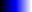

[Components](../components.md)

----

# ColorMap
		
The ColorMap component allows to select a colorMap from a list of colorMaps. 
	


The enum [./src/components/colorMap/colorMap.js](../../../src/components/colorMap/colorMap.js) provides some predefined colorMaps, that are used with the JavaScript attribute 'value' (also see below). 

ColorMap.blank =>                  
ColorMap.blue =>            
ColorMap.bluegreen => new ColorMap('bluegreen');                    
ColorMap.bluegreenStep => new ColorMap('bluegreen-step');                    
ColorMap.complement => new ColorMap('complement');                    
ColorMap.complementStep => new ColorMap('complement-step');                    
ColorMap.green => new ColorMap('green');                    
ColorMap.grey => new ColorMap('grey');                    
ColorMap.greyStep5 => new ColorMap('grey-step5');                    
ColorMap.greyStep6 => new ColorMap('grey-step6');                    
ColorMap.heat => new ColorMap('heat');                    
ColorMap.red => new ColorMap('red');                    
ColorMap.rojal => new ColorMap('rojal');                    
ColorMap.rojalStep => new ColorMap('rojal-step');                    
ColorMap.spectrum => new ColorMap('spectrum');                    
ColorMap.spectrumStep => new ColorMap('spectrum-step');                    
ColorMap.spectrum2 => new ColorMap('spectrum2');                    
ColorMap.spectrum2Step => new ColorMap('spectrum2-step');                    
ColorMap.transblack => new ColorMap('transblack');                    
ColorMap.transblackStep => new ColorMap('transblack-step');

		
## Source code

[./src/components/color/treezColor.js](../../../src/components/color/treezColor.js)

## Test

[./test/components/color/treezColor.test.js](../../../test/components/color/treezColor.test.js)

## Demo

[./demo/components/color/treezColorDemo.html](../../../demo/components/color/treezColorDemo.html)

## Construction

```javascript
    ...
    sectionContent.append('treez-color')
		  .label('Color')		  
		  .value('blue')		
		  .bindValue(this, () => this.color);	
   ...
```

## JavaScript Attributes

### value

Returns the current color as enum value. If the color does not belong to the predefined colors, an enum value with the name 'custom' (including the custom hex string) is returned. 

In orde to set the value, you can either use an enum value or a string value (including the hex code or the name of the color).  

### disabled

The disabled state as a boolean value. 

### hidden

The hidden state as a boolean value.

### width

The total css width as a string, e.g. '500px'.

### label

The label text that is shown before the color as a string. 

## HTML String Attributes

### value

In order to set the value, you can either use a hex string (e.g. value = '#0000ff') or the name of a predefined color, e.g. value = 'blue'.  

If you access the value with element.getAttribute('value'), the hex code of the color is returned as a string. 

### disabled

If you want to enable the component:

* Do not specify the 'disabled' attribute in the html tag

* Use element.setAttribute('disabled', null)) 

If you want to disable the component:

* Specify the 'disabled' attribute in the html tag, e.g. disabled = ''

* Use element.setAttribute('disabled','') or set it to any other value not equal to null. 

### hidden

If you want to show the component:

* Do not specify the 'hidden' attribute in the html tag

* Use element.setAttribute('hidden', null)) 

If you want to hide the component:

* Specify the 'hidden' attribute in the html tag, e.g. hidden = ''

* Use element.setAttribute('hidden','') or set it to any other value not equal to null. 

### width

The total css width of the component, e.g. '500px'

### label

The label text.


----

[ColorMap](../colorMap/colorMap.md)
