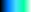
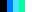
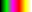
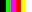
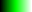
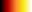
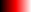
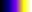
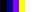

[Components](../components.md)

----

# ColorMap
		
The ColorMap component allows to select a colorMap from a list of colorMaps. 
	


The enum [./src/components/colorMap/colorMap.js](../../../src/components/colorMap/colorMap.js) provides some predefined colorMaps, that are used with the JavaScript attribute 'value' (also see below). 

ColorMap.blank =>                  
ColorMap.blue =>            
ColorMap.bluegreen =>                
ColorMap.bluegreenStep =>                 
ColorMap.complement =>                     
ColorMap.complementStep =>                   
ColorMap.green =>             
ColorMap.grey =>             
ColorMap.greyStep5 =>                 
ColorMap.greyStep6 =>                      
ColorMap.heat =>                  
ColorMap.red =>                         
ColorMap.rojal =>              
ColorMap.rojalStep =>                      
ColorMap.spectrum =>                 
ColorMap.spectrumStep =>                         
ColorMap.spectrum2 =>                       
ColorMap.spectrum2Step =>                     
ColorMap.transblack =>           
ColorMap.transblackStep =>     

		
## Source code

[./src/components/colorMap/treezColorMap.js](../../../src/components/colorMap/treezColorMap.js)

## Test

[./test/components/colorMap/treezColorMap.test.js](../../../test/components/colorMap/treezColorMap.test.js)

## Demo

[./demo/components/colorMap/treezColorMapDemo.html](../../../demo/components/colorMap/treezColorMapDemo.html)

## Construction

```javascript
    ...
    sectionContent.append('treez-color-map')
		  .label('')		  
		  .value('rojal')		
		  .bindValue(this, () => this.colorMap);	
   ...
```

## JavaScript Attributes

### value

Returns the current colorMap as enum value. 

In orde to set the value, you can either use an enum value or a string value (= name of the colorMap).  

### disabled

The disabled state as a boolean value. 

### hidden

The hidden state as a boolean value.

### width

The total css width as a string, e.g. '500px'.

### label

Some label text that is shown before the color map as a string. 

## HTML String Attributes

### value

The name of the color map. 

### disabled

If you want to enable the component:

* Do not specify the 'disabled' attribute in the html tag

* Use element.setAttribute('disabled', null)) 

If you want to disable the component:

* Specify the 'disabled' attribute in the html tag, e.g. disabled = ''

* Use element.setAttribute('disabled','') or set it to any other value not equal to null. 

### hidden

If you want to show the component:

* Do not specify the 'hidden' attribute in the html tag

* Use element.setAttribute('hidden', null)) 

If you want to hide the component:

* Specify the 'hidden' attribute in the html tag, e.g. hidden = ''

* Use element.setAttribute('hidden','') or set it to any other value not equal to null. 

### width

The total css width of the component, e.g. '500px'

### label

Some label text that is shown before the color map as a string. 


----

[ComboBox](../comboBox/comboBox.md)
