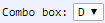

[Components](../components.md)

----

# ComboBox
		
The ComboBox component is used to select an option (string) from a list of predefiend options. 
	

		
## Source code

[./src/components/comboBox/treezComboBox.js](../../../src/components/comboBox/treezComboBox.js)

## Test

[./test/components/comboBox/treezComboBox.test.js](../../../test/components/comboBox/treezComboBox.test.js)

## Demo

[./demo/components/comboBox/treezComboBoxDemo.html](../../../demo/components/comboBox/treezComboBoxDemo.html)

## Construction

```javascript
    ...
    sectionContent.append('treez-combo-box')
		  .label('Mode')
		  .attr('options', '["C","D"]')
		  .value('D')
		  .onChange(() => this.showAndHideDependentComponents())
		  .bindValue(this, () => this.mode);	
   ...
```

## JavaScript Attributes

### options

The predefined options that can be selected, given as string array, e.g. \['C','D'\]

### value

The current value (= selected option) as a string. 

### Inherited attributes

Also see the attributes that are inherited from [LabeledTreezElement](../labeledTreezElement.md#value).

## HTML String Attributes

### options

The predefined options that can be selected, given as a string that can be evaluated as array, e.g. '\["C","D"\]'

### value

The current value (=selected option). 

### Inherited attributes

Also see the attributes that are inherited from [LabeledTreezElement](../labeledTreezElement.md#value-1).


----

[DirectoryPath](../file/directoryPath.md)
