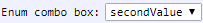

[Components](../components.md)

----

# EnumComboBox
		
The EnumComboBox component is used to select an option from a list of predefiend options. 
The available options are given by an enum class, inheriting from [Enum](../../../src/components/enum.js). 
	

		
## Source code

[./src/components/comboBox/treezEnumComboBox.js](../../../src/components/comboBox/treezEnumComboBox.js)

## Test

[./test/components/comboBox/treezEnumComboBox.test.js](../../../test/components/comboBox/treezEnumComboBox.test.js)

## Demo

[./demo/components/comboBox/treezEnumComboBoxDemo.html](../../../demo/components/comboBox/treezEnumComboBoxDemo.html)

## Construction

```javascript
    ...
    sectionContent.append('treez-enum-combo-box')
		  .label('Hallo')
		  .nodeAttr('enum', MyEnumClass)
		  .value('secondValue')		
		  .bindValue(this, () => this.mode);	
   ...
```

## JavaScript Attributes

### options

The enum class that provides the available options that can be selected.

### value

The current value (= selected option) as an enum value. 

### Inherited attributes

Also see the attributes that are inherited from [LabeledTreezElement](../labeledTreezElement.md#value).

## HTML String Attributes

### options

The predefined options that can be selected, given as a string that can be evaluated as array, e.g. '\["firstValue","secondValue"\]'

### value

The current value string (=selected option). 

### Inherited attributes

Also see the attributes that are inherited from [LabeledTreezElement](../labeledTreezElement.md#value-1).


----

[ErrorBarStyle](../errorBarStyle/errorBarStyle.md)
