[Content](../../README.md)

----

# Components

Treez provides custom [web components](https://developers.google.com/web/fundamentals/web-components) that are used to build the content of the [Properties View](../views/propertyView.md) when selecting an atom in the [Tree View](../views/treeView.md):

||
--- | --- |
| [CheckBox](./checkBox/checkBox.md) | 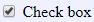|
| [CodeArea](./text/code/codeArea.md) ||
| [Color](./color/color.md)| 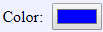|
| [ColorMap](./colorMap/colorMap.md)| 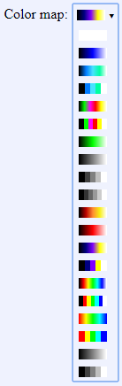|
| [ComboBox](./comboBox/comboBox.md)| |
| [DirectoryPath](./file/directoryPath.md)| |
| [Double](./number/double.md)| 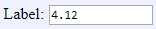|
| [EnumComboBox](./comboBox/enumComboBox.md)| 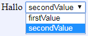|
| [ErrorBarStyle](./errorBarStyle/errorBarStyle.md)| 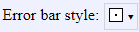|
| [FileOrDirectoryPath](./file/fileOrDirectoryPath.md)| 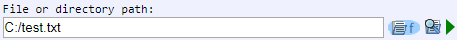|
| [FilePath](./file/filePath.md)| 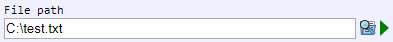|
| [FillStyle](./fillStyle/fillStyle.md)| |
| [Font](./font/font.md)| |
| [ImageComboBox](./comboBox/imageComboBox.md)| 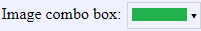|
| [Integer](./number/integer.md)| 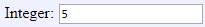|
| [LineStyle](./lineStyle/lineStyle.md)| 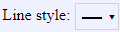|
| [StringList](./list/stringList.md) ||
| [StringItemList](./list/stringItemList.md)| |
| [ModelPath](./modelPath/modelPath.md)| |
| [Section](./section/section.md)| |
| [Size](./size/size.md)| 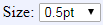|
| [SymbolStyle](./symbolStyle/symbolStyle.md)| 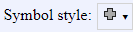|
| [TextArea](./text/area/textArea.md)| |
| [TextField](./text/field/textField.md)| 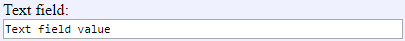|
| [TextLabel](./text/label/textLabel.md)| 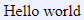|
