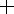
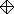
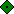
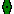
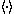
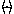
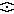
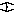

[Components](../components.md)

----

# ErrorBarStyle
		
The ErrorBarStyle component allows to select the style for error bars in a plot. 
	


The enum [./src/components/errorBarStyle/errorBarStyle.js](../../../src/components/errorBarStyle/errorBarStyle.js) provides 
predefined style options, that are used with the JavaScript attribute 'value' (also see below). 


*  ErrorBarStyle.bar

*  ErrorBarStyle.barBox  

*  ErrorBarStyle.barCurve  

*  ErrorBarStyle.barDiamond  

*  ErrorBarStyle.barEnds  

*  ErrorBarStyle.box  

*  ErrorBarStyle.boxFill  

*  ErrorBarStyle.curve  

*  ErrorBarStyle.diamond  

*  ErrorBarStyle.diamondFill  

*  ErrorBarStyle.fillHorz  

*  ErrorBarStyle.fillVert  

*  ErrorBarStyle.lineHorz  

*  ErrorBarStyle.lineHorzBar

*  ErrorBarStyle.lineVert

*  ErrorBarStyle.lineVertBar

		
## Source code

[./src/components/errorBarStyle/treezErrorBarStyle.js](../../../src/components/errorBarStyle/treezErrorBarStyle.js)

## Test

[./test/components/errorBarStyle/treezErrorBarStyle.test.js](../../../test/components/errorBarStyle/treezErrorBarStyle.test.js)

## Demo

[./demo/components/errorBarStyle/treezErrorBarStyleDemo.html](../../../demo/components/errorBarStyle/treezErrorBarStyleDemo.html)

## Construction

```javascript
    ...
    sectionContent.append('treez-error-bar-style')
		  .label('Error bar style:')		  
		  .value('box')		
		  .bindValue(this, () => this.errorBarStyle);	
   ...
```

## JavaScript Attributes

### value

Returns the current error bar style as enum value. 
In order to set the value, you can either use an enum value or a string value (= name of ErrorBarStyle). 

### label

Some label text that is shown before the style combo box as a string. 

### disabled

The disabled state as a boolean value. 

### hidden

The hidden state as a boolean value.

### width

The total css width as a string, e.g. '500px'.


## HTML String Attributes

### value

The name of the ErrorBarStyle.

### label

Some label text.

### disabled

If you want to enable the component:

* Do not specify the 'disabled' attribute in the html tag

* Use element.setAttribute('disabled', null)) 

If you want to disable the component:

* Specify the 'disabled' attribute in the html tag, e.g. disabled = ''

* Use element.setAttribute('disabled','') or set it to any other value not equal to null. 

### hidden

If you want to show the component:

* Do not specify the 'hidden' attribute in the html tag

* Use element.setAttribute('hidden', null)) 

If you want to hide the component:

* Specify the 'hidden' attribute in the html tag, e.g. hidden = ''

* Use element.setAttribute('hidden','') or set it to any other value not equal to null. 

### width

The total css width of the component, e.g. '500px'


----

[FileOrDirectoryPath](../file/fileOrDirectoryPath.md)
