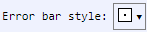

[Components](../components.md)

----

# ErrorBarStyle
		
The ErrorBarStyle component allows to select the style for error bars in a plot. 
	


The enum [./src/components/errorBarStyle/errorBarStyle.js](../../../src/components/errorBarStyle/errorBarStyle.js) provides 
predefined style options, that are used with the JavaScript attribute 'value' (also see below). 


*  ErrorBarStyle.bar

*  ErrorBarStyle.barBox  

*  ErrorBarStyle.barCurve  

*  ErrorBarStyle.barDiamond  

*  ErrorBarStyle.barEnds  

*  ErrorBarStyle.box  

*  ErrorBarStyle.boxFill  

*  ErrorBarStyle.curve  

*  ErrorBarStyle.diamond  

*  ErrorBarStyle.diamondFill  

*  ErrorBarStyle.fillHorz  

*  ErrorBarStyle.fillVert  

*  ErrorBarStyle.lineHorz  

*  ErrorBarStyle.lineHorzBar

*  ErrorBarStyle.lineVert

*  ErrorBarStyle.lineVertBar

		
## Source code

[./src/components/errorBarStyle/treezErrorBarStyle.js](../../../src/components/errorBarStyle/treezErrorBarStyle.js)

## Test

[./test/components/errorBarStyle/treezErrorBarStyle.test.js](../../../test/components/errorBarStyle/treezErrorBarStyle.test.js)

## Demo

[./demo/components/errorBarStyle/treezErrorBarStyleDemo.html](../../../demo/components/errorBarStyle/treezErrorBarStyleDemo.html)

## Construction

```javascript
    ...
    sectionContent.append('treez-error-bar-style')
		  .label('Error bar style:')		  
		  .value('box')		
		  .bindValue(this, () => this.errorBarStyle);	
   ...
```

## JavaScript Attributes

### value

Returns the current error bar style as enum value. 
In order to set the value, you can either use an enum value or a string value (= name of ErrorBarStyle). 

### Inherited attributes

Also see the attributes that are inherited from [LabeledTreezElement](../labeledTreezElement.md#value).


## HTML String Attributes

### value

The name of the ErrorBarStyle.

### Inherited attributes

Also see the attributes that are inherited from [LabeledTreezElement](../labeledTreezElement.md#value).


----

[FileOrDirectoryPath](../file/fileOrDirectoryPath.md)
