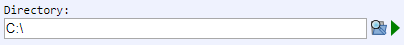

[Components](../components.md)

----

# DirectoryPath
		
The DirectoryPath component allows to select the path to a directory of the file system. 
	


* Click on the browse button  to open a selection dialog or

* Manually enter the path in the text field. 

* Click on the play button  to open the directory.

		
## Source code

[./src/components/file/treezDirectoryPath.js](../../../src/components/file/treezDirectoryPath.js)

## Test

[./test/components/file/treezDirectoryPath.test.js](../../../test/components/file/treezDirectoryPath.test.js)

## Demo

[./demo/components/file/treezDirectoryPathDemo.html](../../../demo/components/file/treezDirectoryPathDemo.html)

## Construction

```javascript
    ...
    sectionContent.append('treez-directory-path')
		  .label('Mode')		
		  .value('D')
		  .onChange(() => this.showAndHideDependentComponents())
		  .bindValue(this, () => this.directoryPath);	
   ...
```

## JavaScript Attributes

### value

The current value (= selected option) as a string. 

### disabled

The disabled state as a boolean value. 

### hidden

The hidden state as a boolean value.

### width

The css width as a string, e.g. '500px'.

### label

The label text that is shown before the combo box as a string. 

### options

The predefined options that can be selected, given as a comma separated string, e.g. 'C,D'

## HTML String Attributes

### value

The current value (=selected option). 

### disabled

If you want to enable the component:

* Do not specify the 'disabled' attribute in the html tag

* Use element.setAttribute('disabled', null)) 

If you want to disable the component:

* Specify the 'disabled' attribute in the html tag, e.g. disabled = ''

* Use element.setAttribute('disabled','') or set it to any other value not equal to null. 

### hidden

If you want to show the component:

* Do not specify the 'hidden' attribute in the html tag

* Use element.setAttribute('hidden', null)) 

If you want to hide the component:

* Specify the 'hidden' attribute in the html tag, e.g. hidden = ''

* Use element.setAttribute('hidden','') or set it to any other value not equal to null. 

### width

The total css width of the component, e.g. '500px'

### label

The label text.

### options

The predefined options that can be selected, separated by comma, e.g. 'C,D'


----

[Double](../number/double.md)
