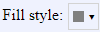
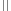
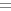

[Components](../components.md)

----

# FillStyle
		
The FillStyle component allows to select the style for fills in a plot. 
	


The enum [./src/components/fillStyle/fillStyle.js](../../../src/components/fillStyle/fillStyle.js) provides 
predefined style options, that are used with the JavaScript attribute 'value' (also see below). 


*  FillStyle.solid

*  FillStyle.vertical  

*  FillStyle.horizontal  

*  FillStyle.cross  
		
## Source code

[./src/components/fillStyle/treezFillStyle.js](../../../src/components/fillStyle/treezErrorBarStyle.js)

## Test

[./test/components/fillStyle/treezFillStyle.test.js](../../../test/components/fillStyle/treezFillStyle.test.js)

## Demo

[./demo/components/errorBarStyle/treezFillStyleDemo.html](../../../demo/components/fillStyle/treezFillStyleDemo.html)

## Construction

```javascript
    ...
    sectionContent.append('treez-fill-style')
		  .label('Fill style:')		  
		  .value('solid')		
		  .bindValue(this, () => this.fillStyle);	
   ...
```

## JavaScript Attributes

### value

Returns the current fill style as enum value. 
In order to set the value, you can either use an enum value or a string value (= name of FillStyle). 

### label

Some label text that is shown before the style combo box as a string. 

### disabled

The disabled state as a boolean value. 

### hidden

The hidden state as a boolean value.

### width

The total css width as a string, e.g. '500px'.


## HTML String Attributes

### value

The name of the FillStyle.

### label

Some label text.

### disabled

If you want to enable the component:

* Do not specify the 'disabled' attribute in the html tag

* Use element.setAttribute('disabled', null)) 

If you want to disable the component:

* Specify the 'disabled' attribute in the html tag, e.g. disabled = ''

* Use element.setAttribute('disabled','') or set it to any other value not equal to null. 

### hidden

If you want to show the component:

* Do not specify the 'hidden' attribute in the html tag

* Use element.setAttribute('hidden', null)) 

If you want to hide the component:

* Specify the 'hidden' attribute in the html tag, e.g. hidden = ''

* Use element.setAttribute('hidden','') or set it to any other value not equal to null. 

### width

The total css width of the component, e.g. '500px'


----

[Font](../font/font.md)
