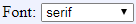

[Components](../components.md)

----

# Font
		
The Font component allows to select a font family. 
	

		
## Source code

[./src/components/font/treezFont.js](../../../src/components/font/treezFont.js)

## Test

[./test/components/font/treezFont.test.js](../../../test/components/font/treezFont.test.js)

## Demo

[./demo/components/font/treezFontDemo.html](../../../demo/components/font/treezFontDemo.html)

## Construction

```javascript
    ...
    sectionContent.append('treez-font')
		  .label('Font:')		  
		  .value('solid')		
		  .bindValue(this, () => this.font);	
   ...
```

## JavaScript Attributes

### value

The current font family as string. 

### label

Some label text that is shown before the style combo box as a string. 

### disabled

The disabled state as a boolean value. 

### hidden

The hidden state as a boolean value.

### width

The total css width as a string, e.g. '500px'.


## HTML String Attributes

### value

The current font family as string.

### label

Some label text.

### disabled

If you want to enable the component:

* Do not specify the 'disabled' attribute in the html tag

* Use element.setAttribute('disabled', null)) 

If you want to disable the component:

* Specify the 'disabled' attribute in the html tag, e.g. disabled = ''

* Use element.setAttribute('disabled','') or set it to any other value not equal to null. 

### hidden

If you want to show the component:

* Do not specify the 'hidden' attribute in the html tag

* Use element.setAttribute('hidden', null)) 

If you want to hide the component:

* Specify the 'hidden' attribute in the html tag, e.g. hidden = ''

* Use element.setAttribute('hidden','') or set it to any other value not equal to null. 

### width

The total css width of the component, e.g. '500px'


----

[ImageComboBox](../imageComboBox/imageComboBox.md)
