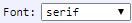

[Components](../components.md)

----

# Font
		
The Font component allows to select a font family. 
	


Available fonts families:

*  <span style="font-family: 'serif';">serif</span>
*  <span style="font-family: 'sans-serif';">sans-serif</span>
*  <span style="font-family: 'cursive';">cursive</span>
*  <span style="font-family: 'fantasy';">fantasy</span>
*  <span style="font-family: 'monospace';">monospace</span>
		
## Source code

[./src/components/font/treezFont.js](../../../src/components/font/treezFont.js)

## Test

[./test/components/font/treezFont.test.js](../../../test/components/font/treezFont.test.js)

## Demo

[./demo/components/font/treezFontDemo.html](../../../demo/components/font/treezFontDemo.html)

## Construction

```javascript
    ...
    sectionContent.append('treez-font')
		  .label('Font:')		  
		  .value('serif')		
		  .bindValue(this, () => this.font);	
   ...
```

## JavaScript Attributes

### value

The current font family as string. 

### Inherited attributes

Also see the attributes that are inherited from [LabeledTreezElement](../labeledTreezElement.md#value).


## HTML String Attributes

### value

The current font family as string.

### Inherited attributes

Also see the attributes that are inherited from [LabeledTreezElement](../labeledTreezElement.md#value-1).


----

[ImageComboBox](../comboBox/imageComboBox.md)
