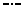

[Components](../components.md)

----

# LineStyle
		
The LineStyle component allows to select the style for lines in a plot. 
	


The enum [./src/components/lineStyle/lineStyle.js](../../../src/components/lineStyle/lineStyle.js) provides 
predefined style options, that are used with the JavaScript attribute 'value' (also see below). 

*  LineStyle.none

*  LineStyle.solid

*  	LineStyle.dashed

*  	LineStyle.dotted

*  	LineStyle.dashDot

*  	LineStyle.dashDotDot

*  	LineStyle.dottedFine

*  	LineStyle.dashedFine   

*  	LineStyle.dashDotFine

*  	LineStyle.dot1

*  	LineStyle.dot2

*  	LineStyle.dot3

*  	LineStyle.dot4

*  	LineStyle.dash1

*  	LineStyle.dash2

*  LineStyle.dash3

*  LineStyle.dash4

*  LineStyle.dash5

*  LineStyle.dashDot1

*  LineStyle.dashDot2

*  LineStyle.dashDot3
		
## Source code

[./src/components/lineStyle/treezLineStyle.js](../../../src/components/lineStyle/treezLineStyle.js)

## Test

[./test/components/lineStyle/treezLineStyle.test.js](../../../test/components/lineStyle/treezLineStyle.test.js)

## Demo

[./demo/components/lineStyle/treezLineStyleDemo.html](../../../demo/components/lineStyle/treezLineStyleDemo.html)

## Construction

```javascript
    ...
    sectionContent.append('treez-line-style')
		  .label('Line style:')		  
		  .value('solid')		
		  .bindValue(this, () => this.lineStyle);	
   ...
```

## JavaScript Attributes

### value

Returns the current line style as enum value. 
In order to set the value, you can either use an enum value or a string value (= name of LineStyle). 

### Inherited attributes

Also see the attributes that are inherited from [LabeledTreezElement](../labeledTreezElement.md#value).

## HTML String Attributes

### value

The name of the LineStyle.

### Inherited attributes

Also see the attributes that are inherited from [LabeledTreezElement](../labeledTreezElement.md#value-1).


----

[ModelPath](../modelPath/modelPath.md)
