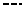
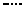
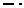
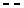
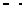
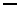
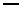
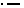
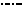

[Components](../components.md)

----

# LineStyle
		
The LineStyle component allows to select the style for lines in a plot. 
	


The enum [./src/components/lineStyle/lineStyle.js](../../../src/components/lineStyle/lineStyle.js) provides 
predefined style options, that are used with the JavaScript attribute 'value' (also see below). 

*  LineStyle.none

*  LineStyle.solid

*  	LineStyle.dashed

*  	LineStyle.dotted

*  	LineStyle.dashDot

*  	LineStyle.dashDotDot

*  	LineStyle.dottedFine

*  	LineStyle.dashedFine   

*  	LineStyle.dashDotFine

*  	LineStyle.dot1

*  	LineStyle.dot2

*  	LineStyle.dot3

*  	LineStyle.dot4

*  	LineStyle.dash1

*  	LineStyle.dash2

*  LineStyle.dash3

*  LineStyle.dash4

*  LineStyle.dash5

*  LineStyle.dashDot1

*  LineStyle.dashDot2

*  LineStyle.dashDot3
		
## Source code

[./src/components/lineStyle/treezLineStyle.js](../../../src/components/lineStyle/treezLineStyle.js)

## Test

[./test/components/lineStyle/treezLineStyle.test.js](../../../test/components/lineStyle/treezLineStyle.test.js)

## Demo

[./demo/components/lineStyle/treezLineStyleDemo.html](../../../demo/components/lineStyle/treezLineStyleDemo.html)

## Construction

```javascript
    ...
    sectionContent.append('treez-line-style')
		  .label('Line style:')		  
		  .value('solid')		
		  .bindValue(this, () => this.lineStyle);	
   ...
```

## JavaScript Attributes

### value

Returns the current line style as enum value. 
In order to set the value, you can either use an enum value or a string value (= name of LineStyle). 

### label

Some label text that is shown before the style combo box as a string. 

### disabled

The disabled state as a boolean value. 

### hidden

The hidden state as a boolean value.

### width

The total css width as a string, e.g. '500px'.

## HTML String Attributes

### value

The name of the LineStyle.

### label

Some label text.

### disabled

If you want to enable the component:

* Do not specify the 'disabled' attribute in the html tag

* Use element.setAttribute('disabled', null)) 

If you want to disable the component:

* Specify the 'disabled' attribute in the html tag, e.g. disabled = ''

* Use element.setAttribute('disabled','') or set it to any other value not equal to null. 

### hidden

If you want to show the component:

* Do not specify the 'hidden' attribute in the html tag

* Use element.setAttribute('hidden', null)) 

If you want to hide the component:

* Specify the 'hidden' attribute in the html tag, e.g. hidden = ''

* Use element.setAttribute('hidden','') or set it to any other value not equal to null. 

### width

The total css width of the component, e.g. '500px'


----

[StringList](../list/stringList.md)
