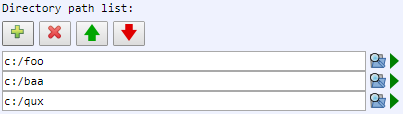

[Components](../components.md)

----

# DirectoryPathList
		
The DirectoryPathList component allows to specify a list of directory paths. 
	


Use the buttons and text fields to edit the entries of the list:

*  Add entry
*  Delete entry
*  Move entry up
*  Move entry down 
		
## Source code

[./src/components/list/treezDirectoryPathList.js](../../../src/components/list/treezDirectoryPathList.js)

## Test

[./test/components/list/treezDirectoryPathList.test.js](../../../test/components/list/treezDirectoryPathList.test.js)

## Demo

[./demo/components/list/treezDirectoryPathListDemo.html](../../../demo/components/list/treezDirectoryPathListDemo.html)

## Construction

```javascript
    ...
    sectionContent.append('treez-directory-path-list')
		  .label('Directory path list:')		  
		  .value('["c:/foo","c:/baa","c:/qux"]')		
		  .bindValue(this, () => this.names);	
   ...
```

## JavaScript Attributes

### value

An array of strings, e.g. \['c:/foo','c:/baa','c:/qux'\]. 

### Inherited attributes

Also see the attributes that are inherited from [LabeledTreezElement](../labeledTreezElement.md#value).


## HTML String Attributes

### value

A string that can be evaluated to an array of strings, e.g. '\["c:/foo","c:/baa","c:/qux"\]'

### Inherited attributes

Also see the attributes that are inherited from [LabeledTreezElement](../labeledTreezElement.md#value1).


----

[Double](../number/double.md)
