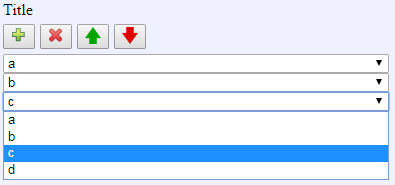

[Components](../components.md)

----

# StringItemList
		
The StringItemList component allows to specify a list of string values, where each item can be selected from a predefined list. 
	


Use the buttons and combo boxes to edit the entries of the list:

*  Add entry
*  Delete entry
*  Move entry up
*  Move entry down 
		
## Source code

[./src/components/list/treezStringItemList.js](../../../src/components/list/treezStringItemList.js)

## Test

[./test/components/list/treezStringItemList.test.js](../../../test/components/list/treezStringItemList.test.js)

## Demo

[./demo/components/list/treezStringItemListDemo.html](../../../demo/components/list/treezStringItemListDemo.html)

## Construction

```javascript
    ...
    sectionContent.append('treez-string-item-list')
		  .label('Title')		  
      		  .attr('options','["a","b","c","d"]')
		  .value('["a","b","c"]')		
		  .bindValue(this, () => this.modeList);	
   ...
```

## JavaScript Attributes


### options

The array of available string values/items, e.g. \['a','b','c','d'\]. 

### value

The array of specified string values/items, e.g. \['a','b','c'\]. 

### label

Some label text that is shown above the list. 

### disabled

The disabled state as a boolean value. 

### hidden

The hidden state as a boolean value.

### width

The total css width as a string, e.g. '500px'.


## HTML String Attributes

### options

A string that can be evaluated to an array of strings and represents the available values/items, e.g. '\["a","b","c","d"\]'

### value

A string that can be evaluated to an array of strings and represents the selected values/items, e.g. '\["a","b","c"]'

### label

Some label text that is shown above the list. 

### disabled

If you want to enable the component:

* Do not specify the 'disabled' attribute in the html tag

* Use element.setAttribute('disabled', null)) 

If you want to disable the component:

* Specify the 'disabled' attribute in the html tag, e.g. disabled = ''

* Use element.setAttribute('disabled','') or set it to any other value not equal to null. 

### hidden

If you want to show the component:

* Do not specify the 'hidden' attribute in the html tag

* Use element.setAttribute('hidden', null)) 

If you want to hide the component:

* Specify the 'hidden' attribute in the html tag, e.g. hidden = ''

* Use element.setAttribute('hidden','') or set it to any other value not equal to null. 

### width

The total css width of the component, e.g. '500px'


----

[ModelPath](../modelPath/modelPath.md)
