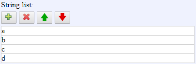

[Components](../components.md)

----

# StringList
		
The StringList component allows to specify a list of string values. 
	


Use the buttons and text fields to edit the entries of the list:

*  Add entry
*  Delete entry
*  Move entry up
*  Move entry down 
		
## Source code

[./src/components/list/treezStringList.js](../../../src/components/list/treezStringList.js)

## Test

[./test/components/list/treezStringList.test.js](../../../test/components/list/treezStringList.test.js)

## Demo

[./demo/components/list/treezStringListDemo.html](../../../demo/components/list/treezStringListDemo.html)

## Construction

```javascript
    ...
    sectionContent.append('treez-string-list')
		  .label('Title')		  
		  .value('["a","b","c","d"]')		
		  .bindValue(this, () => this.names);	
   ...
```

## JavaScript Attributes

### value

An array of strings, e.g. \['a','b','c','d'\]. 

### label

Some label text that is shown above the list. 

### disabled

The disabled state as a boolean value. 

### hidden

The hidden state as a boolean value.

### width

The total css width as a string, e.g. '500px'.


## HTML String Attributes

### value

A string that can be evaluated to an array of strings, e.g. '\["a","b","c","d"\]'

### label

Some label text that is shown above the list. 

### disabled

If you want to enable the component:

* Do not specify the 'disabled' attribute in the html tag

* Use element.setAttribute('disabled', null)) 

If you want to disable the component:

* Specify the 'disabled' attribute in the html tag, e.g. disabled = ''

* Use element.setAttribute('disabled','') or set it to any other value not equal to null. 

### hidden

If you want to show the component:

* Do not specify the 'hidden' attribute in the html tag

* Use element.setAttribute('hidden', null)) 

If you want to hide the component:

* Specify the 'hidden' attribute in the html tag, e.g. hidden = ''

* Use element.setAttribute('hidden','') or set it to any other value not equal to null. 

### width

The total css width of the component, e.g. '500px'


----

[StringItemList](./stringItemList.md)
