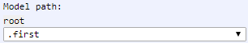

[Components](../components.md)

----

# ModelPath
		
The ModelPath component allows to select atoms from the tree model, fulfilling certain criteria.  
	


The criteria for the available atoms (whose tree paths are shown in the combo box menu) might be:

* the class of the atoms must inherit from a certain super class (e.g. show all model atoms) 
* the class of the atoms must fullfill e certain interface (= must provide certain methods)

Furthermore, the found atoms can be confined with a custom filter method. 
		
## Source code

[./src/components/modelPath/treezModelPath.js](../../../src/components/modelPath/treezModelPath.js)

## Test

[./test/components/modelPath/treezModelPath.test.js](../../../test/components/modelPath/treezModelPath.test.js)

## Demo

[./demo/components/modelPath/treezModelPathDemo.html](../../../demo/components/modelPath/treezModelPathDemo.html)

## Construction

```javascript
    ...
    sectionContent.append('treez-model-path')
		  .label('Model path:')		  
                  .nodeAttr('atomClasses',[Models])
		  .nodeAttr('relativeRootAtom', this)
		  .nodeAttr('filterDelegate', (atom) =>{return atom.name[0] === 's'; })
		  .value('root.second')		
		  .bindValue(this, () => this.modelPath);	
   ...
```

## JavaScript Attributes

### value

The selected model path as string, e.g. 'root.second'. 

### atomClasses

An array of atom classes (e.g. [Models]), used to filter the available model paths. 

### atomFunctionNames

An array of function names (e.g. ["run","paint"]), used to filter the available model paths. Each of the found atoms needs to have all the given methods.

### filterDelegate

A Method used to filter the available model paths, e.g. (atom) =>{return atom.name[0] === 's'; }.

### relativeRootAtom

An atom that is used as relative root. If a relative root atom is specified, the model path is split in two parts. This way, the available model paths shown in the combo box become shorter and easier to select.  

### Inherited attributes

Also see the attributes that are inherited from [LabeledTreezElement](../labeledTreezElement.md#value).


## HTML String Attributes


### value

The selected model path as string, e.g. 'root.second'.

### Inherited attributes

Also see the attributes that are inherited from [LabeledTreezElement](../labeledTreezElement.md#value-1).


----

[Section](../section/section.md)
