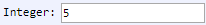

[Components](../components.md)

----

# Integer
		
The Integer component is used to specify an integer number.  
	


* If you use scientific notation (e.g. 1.5e3), please note that the shown **decimal separator** might depend on 
the language settings of your browser. In order to avoid confusion, we recomment to use "English (United States)" 
in the language settings 
(e.g. Settings => Advanced => Languages => This language is used to display the Google Chrome UI). 
This way, the decimal separator of the Properties View of Treez is the same as the one used in the source
code of the Editor View.

* Please note that JavaScript comes with some limitation for the precision of numbers. Also see 
  * https://stackoverflow.com/questions/22838588/javascript-max-int
  * https://stackoverflow.com/questions/1458633/how-to-deal-with-floating-point-number-precision-in-javascript
		
## Source code

[./src/components/number/treezInteger.js](../../../src/components/number/treezInteger.js)

## Test

[./test/components/number/treezInteger.test.js](../../../test/components/number/treezInteger.test.js)

## Demo

[./demo/components/number/treezIntegerDemo.html](../../../demo/components/number/treezIntegerDemo.html)

## Construction

```javascript
    ...
    sectionContent.append('treez-integer')
		  .label('Integer:')		
		  .value('5')		
		  .bindValue(this, () => this.numberOfUsers);	
   ...
```

## JavaScript Attributes

### value

The current value as a number. 

### min

The minimum value that can be entered (default is Number.MIN_SAFE_INTEGER = -9007199254740991).

### max

The maximum value that can be entered (default is Number.MAX_SAFE_INTEGER = 9007199254740991).

### Inherited attributes

Also see the attributes that are inherited from [LabeledTreezElement](../labeledTreezElement.md#value).


## HTML String Attributes

### value

Returns the current value as string. 

Setting the attribute does not only work with strings but also without quotes in Google Chrome, e.g. 
* element.setAttribute('value', 5) or
* \<treez-integer value = 5 ></treez-integer>

### min

The minimum value that can be entered as a string (default is '-9007199254740991').

### max

The maximum value that can be entered as a string (default is '9007199254740991').

### Inherited attributes

Also see the attributes that are inherited from [LabeledTreezElement](../labeledTreezElement.md#value-1).


----

[LabeledTreezElement](../labeledTreezElement.md)
