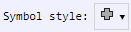

[Components](../components.md)

----

# SymbolStyle
		
The SymbolStyle component allows to select the style for symbols in a plot. 
	


The enum [./src/components/symbolStyle/symbolStyle.js](../../../src/components/symbolStyle/symbolStyle.js) provides 
predefined style options, that are used with the JavaScript attribute 'value' (also see below). 

*  SymbolStyle.none  

*  SymbolStyle.circle

*  SymbolStyle.cross

*  SymbolStyle.diamond

*  SymbolStyle.square

*  SymbolStyle.star   

*  SymbolStyle.triangle

*  SymbolStyle.why
		
## Source code

[./src/components/symbolStyle/treezSymbolStyle.js](../../../src/components/symbolStyle/treezErrorBarStyle.js)

## Test

[./test/components/symbolStyle/treezSymbolStyle.test.js](../../../test/components/symbolStyle/treezSymbolStyle.test.js)

## Demo

[./demo/components/symbolStyle/treezSymbolStyleDemo.html](../../../demo/components/symbolStyle/treezSymbolStyleDemo.html)

## Construction

```javascript
    ...
    sectionContent.append('treez-symbol-style')
		  .label('Symbol style:')		  
		  .value('cross')		
		  .bindValue(this, () => this.symbolStyle);	
   ...
```

## JavaScript Attributes

### value

Returns the current symbol style as enum value. 
In order to set the value, you can either use an enum value or a string value (= name of SymbolStyle). 

### Inherited attributes

Also see the attributes that are inherited from [LabeledTreezElement](../labeledTreezElement.md#value).


## HTML String Attributes

### value

The name of the SymbolStyle.

### Inherited attributes

Also see the attributes that are inherited from [LabeledTreezElement](../labeledTreezElement.md#value-1).


----

[TextArea](../text/area/textArea.md)
