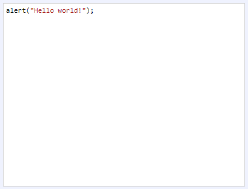

[Components](../components.md)

----

# CodeArea
		
The CodeArea allows to edit some source code. 
	

		
## Source code

[./src/components/text/code/treezCodeArea.js](../../../../src/components/text/code/treezCodeArea.js)

## Test

[./test/components/text/code/treezCodeArea.test.js](../../../../test/components/text/code/treezCodeArea.test.js)

## Demo

[./demo/components/text/code/treezCodeAreaDemo.html](../../../../demo/components/text/code/treezCodeAreaDemo.html)

## Construction

```javascript
    ...
    sectionContent.append('treez-code-area')
		  .label('')		  
		  .value('alert("Hello world!")')		
		  .bindValue(this, () => this.code);	
   ...
```

## JavaScript Attributes

### value

The source code as string. 

### mode

In order to influcence highlighting you can choose from following modes: 'javascript' (default), 'sql' or 'python'.

### disabled

The disabled state as a boolean value. 

### hidden

The hidden state as a boolean value.

### width

The total css width as a string, e.g. '500px'.

### label

Some label text that is shown above the code area.


## HTML String Attributes

### value

The source code.

### disabled

If you want to enable the component:

* Do not specify the 'disabled' attribute in the html tag

* Use element.setAttribute('disabled', null)) 

If you want to disable the component:

* Specify the 'disabled' attribute in the html tag, e.g. disabled = ''

* Use element.setAttribute('disabled','') or set it to any other value not equal to null. 

### hidden

If you want to show the component:

* Do not specify the 'hidden' attribute in the html tag

* Use element.setAttribute('hidden', null)) 

If you want to hide the component:

* Specify the 'hidden' attribute in the html tag, e.g. hidden = ''

* Use element.setAttribute('hidden','') or set it to any other value not equal to null. 

### width

The total css width of the component, e.g. '500px'

### label

Some label text that is shown above the code area.

 


----

[Color](../../color/color.md)
