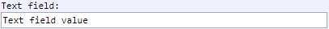

[Components](../components.md)

----

# TextField
		
The TextField component allows to specify some text.  
	

		
## Source code

[./src/components/textField/treezTextField.js](../../../../src/components/textField/treezTextField.js)

## Test

[./test/components/textField/treezTextField.test.js](../../../../test/components/textField/treezTextField.test.js)

## Demo

[./demo/components/textField/treezTextFieldDemo.html](../../../../demo/components/textField/treezTextFieldDemo.html)

## Construction

```javascript
    ...
    sectionContent.append('treez-text-field')
		  .label('Text field:')		  
		  .value('Text field value')		
		  .bindValue(this, () => this.text);	
   ...
```

## JavaScript Attributes

### value

The current text. 

### Inherited attributes

Also see the attributes that are inherited from [LabeledTreezElement](../labeledTreezElement.md#value).


## HTML String Attributes

### value

The current text.

### Inherited attributes

Also see the attributes that are inherited from [LabeledTreezElement](../labeledTreezElement.md#value-1).


----

[TextLabel](../label/textLabel.md)
