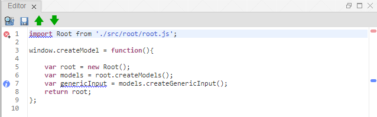
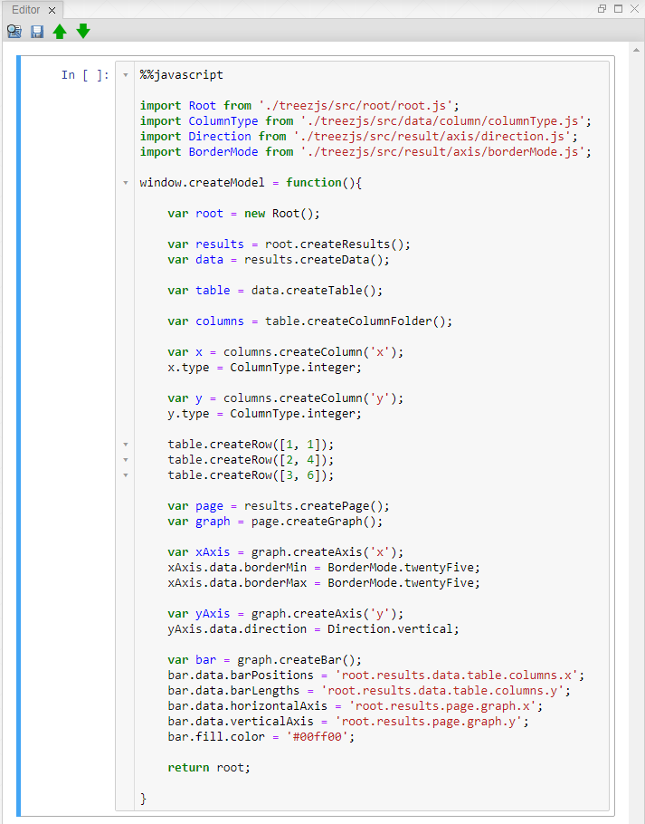

[Views](../views.md)

----

#	Editor View

The purpose of the Editor View is to **edit the tree model** of the application in form of **JavaScript** source code. The source code can be saved and restored as text file. 

Code that this generated from the tree model contains all modified properties (= different to default value) of the treez atoms.

## Toolbar

The toolbar of the Editor View provides several action buttons:

*  **Open from...** Open a text file and show it in the Editor View (first [cell](https://jupyter-notebook.readthedocs.io/en/stable/notebook.html#structure-of-a-notebook-document)). 
*  **Save as...** Download the content of the Editor View (only first cell) as JavScript file *.js. 
*  **Open from local storage** Open a previously stored source code from the local browser storage in the Editor View (first cell) and also import it to the TreeView (="quick open"). 
*  **Save to local storage** Save the content of the Editor View (only first cell) to the local browser storage (="quick save") 

## Appearance

The appearance of the Editor View might be slightly different, depending on how you [installed](../installation.md) treez:

* [**Stand-alone**](../standaloneInstallation.md): [Orion](http://wiki.eclipse.org/Orion) is used as source code editor and line numbers are shown by default. There is no extra border and only one "cell".

* [**Jupyter Notebook extension**](../jupyterInstallation.md): The first [cell](https://jupyter-notebook.readthedocs.io/en/stable/notebook.html#structure-of-a-notebook-document) of the [Jupyter Notebook](https://jupyter.org/) is used as JavaScript source code editor. The cells of the Jupyter Notebook are based on [CodeMirror](https://codemirror.net/). You can [enable line numbers](https://stackoverflow.com/questions/10979667/showing-line-numbers-in-ipython-jupyter-notebooks) if you want. Further cells (containing python code or any other [supported content](https://github.com/jupyter/jupyter/wiki/Jupyter-kernels)) can be added to the Jupyter Notebook below. Each cell has a border indicating its current state/[edit mode](https://jupyter-notebook.readthedocs.io/en/stable/examples/Notebook/Notebook%20Basics.html#Modal-editor) (green = edit mode, blue = command mode). In addition to the buttons of the Editor View from treez, the standard [buttons of the Jupyter Notebook](https://jupyter-notebook.readthedocs.io/en/stable/examples/Notebook/Notebook%20Basics.html#Mouse-navigation) can be used, e.g. to open or save complete *.ipynb notebook files. 

----
[Graphics View](./graphicsView.md)

