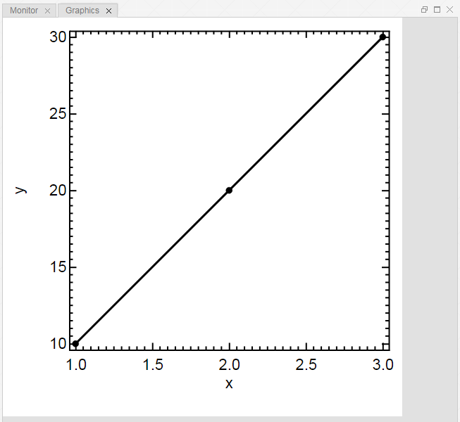

[Views](../views.md)

#	Graphics View

Some of the Treez Atoms have a graphical representation, for example a plot. The purpose of the Graphics View is to show those graphical representations. 

The graphics of Treez can be interactive. Try to click for example on the axis label of a plot to show the properties of the label in the Properties View. 

Also try to double click on a plot in the Graphics View to save it as *.svg file. 

----
[Monitor View](./monitorView.md)
