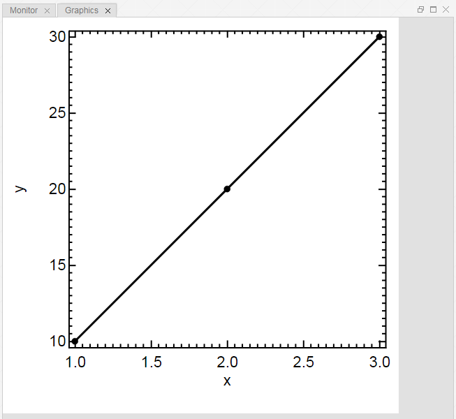

[Views](./views.md)

----

#	Graphics View

Some of the Treez Atoms have a graphical representation, for example a Xy plot. The purpose of the Graphics View is to show those graphical representations. 

The graphics of Treez are based on [d3.js](https://d3js.org/) and can be **interactive**:

* Click for example on the Axis of a Graph to **show the properties** of that Axis in the [Properties View](./propertiesView.md). 
* Double click on a Page in the Graphics View to **export it** as [Scalable Vector Graphics \*.svg](https://en.wikipedia.org/wiki/Scalable_Vector_Graphics) file. The exported \*.svg file can be edited with the open source software [Inkscape](https://inkscape.org/).

----
[Monitor View](./monitorView.md)
