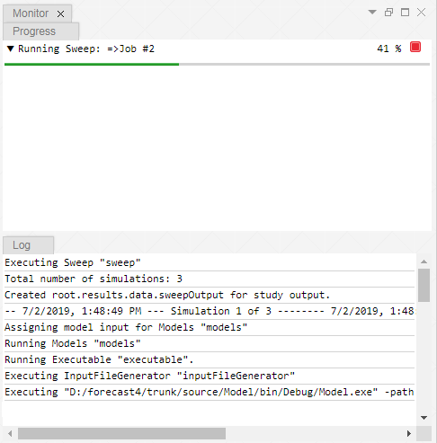

[Views](../views.md)

#	Monitor View

Some of the atoms can be executed and the Monitor View shows the corresponding progress by **progress bars** and **log messages**. 

The progress bar(s) might consist of a hierarchical structure (you could call it another "tree" if you want). Click on the **triangle** symbol at the front of a progress bar to expand the progress bar and **inspect its nested progress bars**. 

You can use the progress bars to **filter the log messages**. Click on a progress bar to see its **corresponding log messages**.

You can request the **cancelation** of the current process by clicking on the red cancel button of the progress bar. (How good the cancellation actually works depends on the implementation and the characteristics of the running process. The process has to check from time to time if a cancelation has been requested. With other words: a cancelation request might not be applied immediately.)

If you use your mouse to **hover over a log message** you can see additional information in a **pop-up window**. That additional information is escpecially useful for **error messages**. If you would like to be get to the source code that caused the error, you can (hopefully) click on a link of the **stack trace** that is shown in the pop-up window of the error log message.  

----
[Atoms](../atoms.md)
