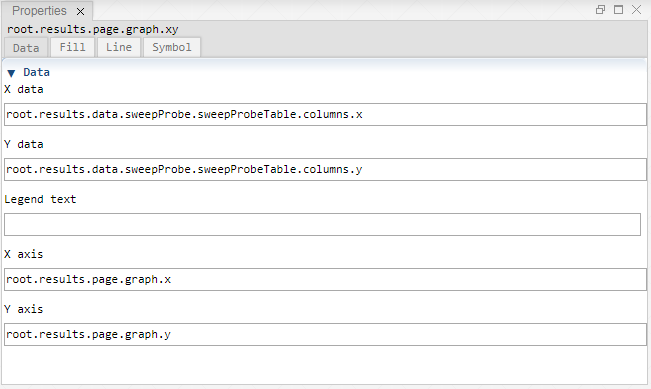

[Views](../views.md)
----

# Properties View

The purpose of the Properties View is to **inspect and edit the properties of a treez atom**. The Properties View is organized with a  a hierarchical structure:

* The Properties View might contain several **tabs**
* A tab might contain several **sections**
* A section might contain several **input elements**

If you click on a node/atom in the [Tree View](./tree_view.md), the corresponding properties are shown in the Properties View.
The tree path of the current atom is typically shown on top of the properties view (e.g. root.results.page.graph.xy). 

----

[Editor View](./editor_view.md)
