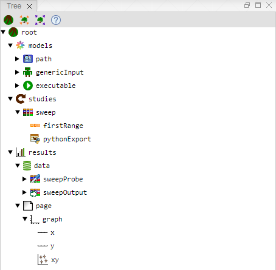
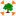
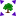
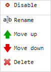

[Views](../views.md)

----

# Tree View

The Tree View is the heart of Treez. It displays a tree model of the application and provides actions to edit that model. Each node of the tree represents a corresponding Treez Atom. The first node of the tree is called "root". 

## Toolbar 

The toolbar of the Tree View provides several action buttons:

*  **Create a [Root](../atoms/root.md) atom** and set it as the content of the Treez View (overrides the previous content of the Tree View). 
*  **Import a tree model** from the currently opened text file (overrides the previous content of the Tree View). 
*  **Export the tree model** to the currently opened text file (overrides the previous content of the text file).
*  **Show help** page in a new tab of the browser: [README.md](https://github.com/stefaneidelloth/treezjs/blob/master/README.md)
 
##	Tree node mouse actions

Users can modify the tree model using mouse actions:

* **Left-click on triangle** symbol: **expand or collapse** a tree node.
*	**Left-click** on node label: **Show the properties** of a node/atom in the [Properties View](./propertiesView.md).
*	**Double-click** on node label: **Fully expand or collapse** a tree node and its children.
*	**Right-click** on node label: Show the **context menu** of a tree node, for example: 

----
[Properties View](./propertiesView.md)
